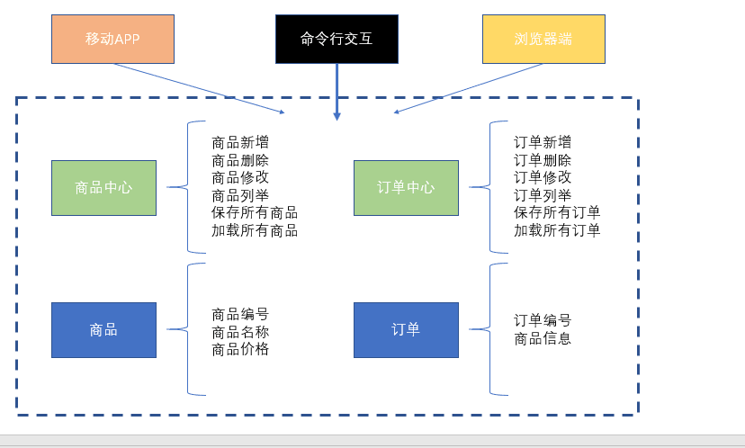
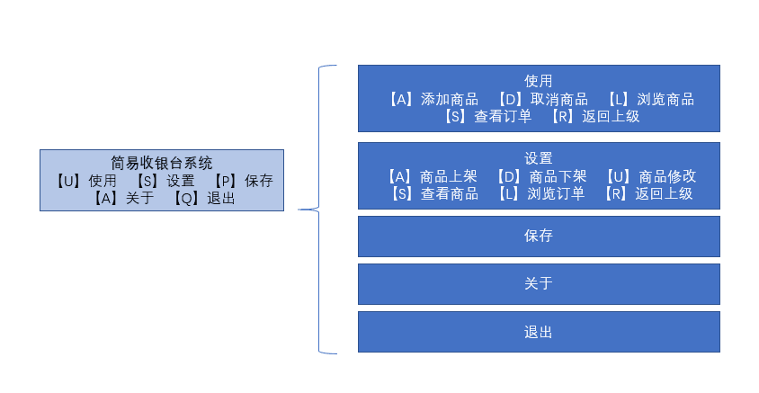

## 项目名称
简易收银台

## 项目描述

实现对商品和订单的增删改查等操作的字符界面的收银台操作系统

## 使用技术
+ Java基础
+ JavaI/O
+ Java集合框架

# 项目功能
+ 商品上架、下架、修改
+ 查看商品
+ 添加、取消、浏览商品
+ 浏览订单
+ 返回上级
+ 退出

# 项目实现

## 项目总结
+ 熟悉项目的开发流程（需求，分析，技术选择，设计，编码，测试，发布）
+ 掌握了Java的基本类与接口的使用
+ 加深了对JavaI/O和集合框架的理解
+ 加深了maven工具的理解和掌握

## 项目扩展
+ 订单汇总到Excel
+ 订单统计分析
+ 商品汇总到Excel
+ 保存功能隐藏，服务后端自动检查和保存
+ 数据保存到数据库
